# APISIX Balancer 流程图

本文档展示了 `apisix/balancer.lua` 的完整执行流程。

## 文件说明

- **源文件**: [apisix/balancer.lua](apisix/balancer.lua)
- **主入口**: `_M.run()` - 在 Nginx balancer 阶段调用
- **核心功能**: 负载均衡、健康检查、重试机制、连接池管理

## 流程图

```mermaid
graph TD
    Start([开始: balancer phase]) --> Run[_M.run 主入口]

    Run --> CheckPicked{是否已在 access<br/>阶段选择了服务器?}

    CheckPicked -->|是| UsePicked[使用 ctx.picked_server]
    CheckPicked -->|否| CheckRetryTimeout{检查重试超时<br/>proxy_retry_deadline}

    CheckRetryTimeout -->|超时| Exit502_1[返回 502 错误]
    CheckRetryTimeout -->|未超时| PickServer[pick_server 选择服务器]

    UsePicked --> SetBalancerOpts[set_balancer_opts<br/>设置超时和重试参数]

    PickServer --> CheckNodeCount{upstream 节点数量}

    CheckNodeCount -->|单节点| ReturnSingleNode[直接返回该节点]
    CheckNodeCount -->|多节点| CheckRetryCount{是否重试?<br/>balancer_try_count > 1}

    CheckRetryCount -->|是| ReportStatus[向健康检查器报告<br/>上次失败状态]
    CheckRetryCount -->|否| GetServerPicker

    ReportStatus --> GetServerPicker{获取 server_picker}

    GetServerPicker -->|缓存未命中| CreateServerPicker[create_server_picker<br/>创建服务器选择器]
    GetServerPicker -->|缓存命中| UseCache[使用缓存的 picker]

    CreateServerPicker --> LoadBalancer[动态加载负载均衡算法<br/>require apisix.balancer.type]

    LoadBalancer --> FetchHealthNodes[fetch_health_nodes<br/>获取健康节点]

    FetchHealthNodes --> CheckHealthChecker{是否有<br/>健康检查器?}

    CheckHealthChecker -->|否| TransformAllNodes[transform_node<br/>转换所有节点]
    CheckHealthChecker -->|是| FilterHealthy[过滤健康节点]

    FilterHealthy --> CheckHealthyCount{健康节点数量}

    CheckHealthyCount -->|0 个| UseAllNodes[使用所有节点<br/>记录警告日志]
    CheckHealthyCount -->|>0 个| TransformHealthy[transform_node<br/>转换健康节点]

    TransformAllNodes --> CheckPriority
    TransformHealthy --> CheckPriority
    UseAllNodes --> CheckPriority

    CheckPriority{优先级数量}

    CheckPriority -->|多优先级| CreatePriorityBalancer[priority_balancer.new<br/>创建优先级负载均衡器]
    CheckPriority -->|单优先级| CreateSimpleBalancer[picker.new<br/>创建简单负载均衡器]

    CreatePriorityBalancer --> UseCache
    CreateSimpleBalancer --> UseCache

    UseCache --> PickerGet[server_picker.get ctx<br/>调用算法选择服务器]

    PickerGet --> CheckServer{是否成功<br/>选择服务器?}

    CheckServer -->|否| Exit502_2[返回 502 错误]
    CheckServer -->|是| ParseAddr[lrucache_addr<br/>解析服务器地址]

    ParseAddr --> SetContext[设置 ctx.balancer_ip<br/>ctx.balancer_port<br/>ctx.server_picker]

    ReturnSingleNode --> SetContext

    SetContext --> CheckPassHost{pass_host<br/>模式检查}

    CheckPassHost -->|node 模式| UpdateHost[更新 upstream_host]
    CheckPassHost -->|其他| RunBeforeProxy

    UpdateHost --> RunBeforeProxy[运行 before_proxy 插件]

    RunBeforeProxy --> CheckRecreate{是否需要重建请求?}

    CheckRecreate -->|是| RecreateRequest[balancer.recreate_request]
    CheckRecreate -->|否| SetCurrentPeer

    RecreateRequest --> SetCurrentPeer[set_current_peer<br/>设置当前对等节点]

    SetBalancerOpts --> SetCurrentPeer

    SetCurrentPeer --> CheckKeepalive{是否启用<br/>keepalive?}

    CheckKeepalive -->|是| ConfigPool[配置连接池<br/>pool_size, idle_timeout<br/>支持 TLS/mTLS]
    CheckKeepalive -->|否| SetPeerSimple[balancer.set_current_peer<br/>简单设置]

    ConfigPool --> EnableKeepalive[balancer.enable_keepalive<br/>启用连接保持]

    EnableKeepalive --> CheckSuccess{设置成功?}
    SetPeerSimple --> CheckSuccess

    CheckSuccess -->|否| Exit502_3[返回 502 错误]
    CheckSuccess -->|是| SetProxyPassed[设置 ctx.proxy_passed = true]

    SetProxyPassed --> End([结束: 代理到上游服务器])

    Exit502_1 --> End
    Exit502_2 --> End
    Exit502_3 --> End

    style Start fill:#e1f5e1
    style End fill:#ffe1e1
    style Exit502_1 fill:#ffcccc
    style Exit502_2 fill:#ffcccc
    style Exit502_3 fill:#ffcccc
    style Run fill:#cce5ff
    style PickServer fill:#cce5ff
    style CreateServerPicker fill:#fff4cc
    style FetchHealthNodes fill:#fff4cc
    style SetCurrentPeer fill:#e1d5f5
```

## 关键函数说明

### 1. `_M.run(route, ctx, plugin_funcs)`
- **位置**: [balancer.lua:334](apisix/balancer.lua#L334)
- **作用**: Balancer 阶段的主入口函数
- **流程**: 检查是否已选择服务器 → 设置选项或选择服务器 → 设置对等节点

### 2. `pick_server(route, ctx)`
- **位置**: [balancer.lua:194](apisix/balancer.lua#L194)
- **作用**: 从 upstream 中选择一个服务器
- **特性**:
  - 单节点直接返回
  - 多节点使用 LRU 缓存的 server_picker
  - 支持重试时报告健康状态

### 3. `create_server_picker(upstream, checker)`
- **位置**: [balancer.lua:98](apisix/balancer.lua#L98)
- **作用**: 创建负载均衡器选择器
- **流程**:
  - 动态加载算法模块（roundrobin/chash/ewma/least_conn）
  - 获取健康节点
  - 根据优先级数量选择简单或优先级负载均衡器

### 4. `fetch_health_nodes(upstream, checker)`
- **位置**: [balancer.lua:63](apisix/balancer.lua#L63)
- **作用**: 获取健康的上游节点
- **逻辑**:
  - 无健康检查器：返回所有节点
  - 有健康检查器：过滤健康节点
  - 所有节点不健康：返回所有节点并记录警告

### 5. `set_current_peer(server, ctx)`
- **位置**: [balancer.lua:279](apisix/balancer.lua#L279)
- **作用**: 设置当前代理的对等节点
- **特性**:
  - 支持 keepalive 连接池
  - 支持 TLS/mTLS
  - 配置连接池大小、空闲超时、请求数

### 6. `set_balancer_opts(route, ctx)`
- **位置**: [balancer.lua:142](apisix/balancer.lua#L142)
- **作用**: 设置负载均衡器选项
- **配置**: 超时（connect/send/read）、重试次数、重试超时

## 数据结构

### LRU 缓存
- `lrucache_server_picker`: 缓存 server_picker（TTL=300s, 容量=256）
- `lrucache_addr`: 缓存解析后的地址（TTL=300s, 容量=4096）

### Context 变量
- `ctx.upstream_conf`: upstream 配置
- `ctx.balancer_ip/port`: 选中的服务器 IP 和端口
- `ctx.server_picker`: 服务器选择器实例
- `ctx.balancer_try_count`: 重试计数
- `ctx.proxy_retry_deadline`: 重试截止时间

## 支持的负载均衡算法

1. **roundrobin** - 加权轮询
2. **chash** - 一致性哈希
3. **ewma** - 指数加权移动平均
4. **least_conn** - 最少连接
5. **自定义** - 可扩展

## 错误处理

所有失败场景都返回 **502 Bad Gateway**：
- 重试超时
- 无法选择有效服务器
- 地址解析失败
- 设置对等节点失败
