# 方案 A 时序图（Redis Cluster + 动态检查优化版本）

## 正常流程（请求成功 - 月初场景）

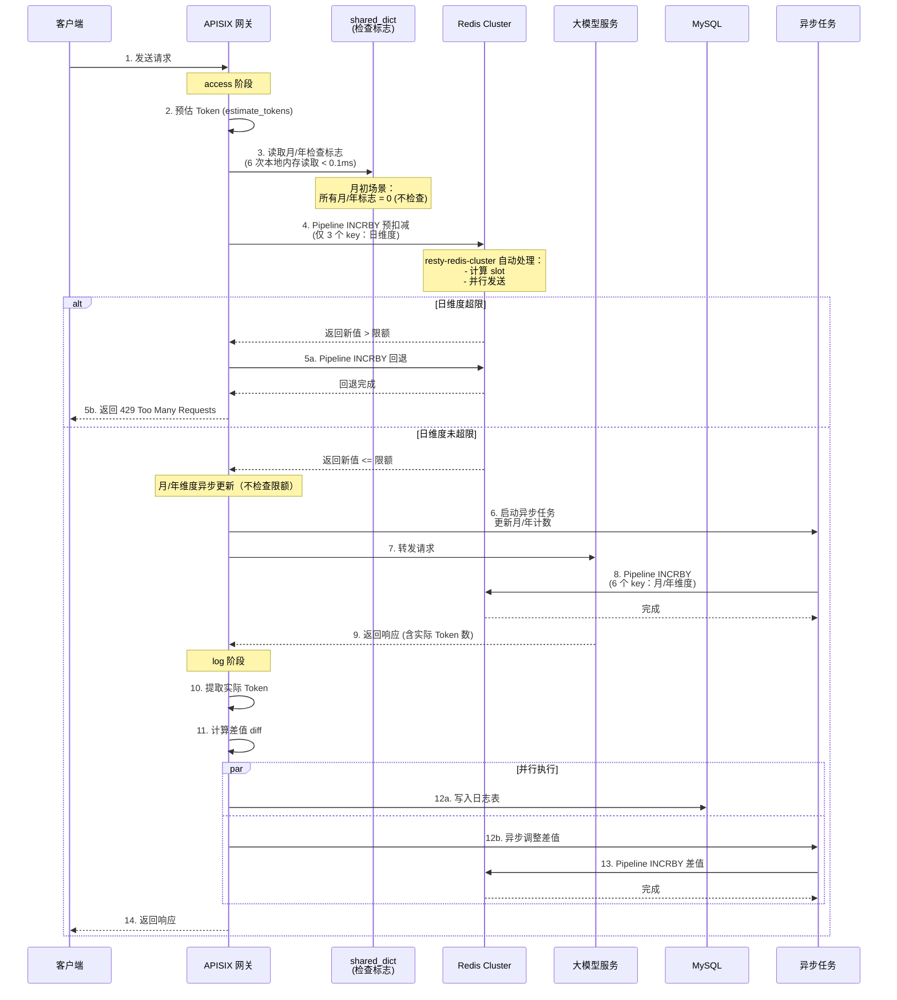

## 正常流程（请求成功 - 月底场景）

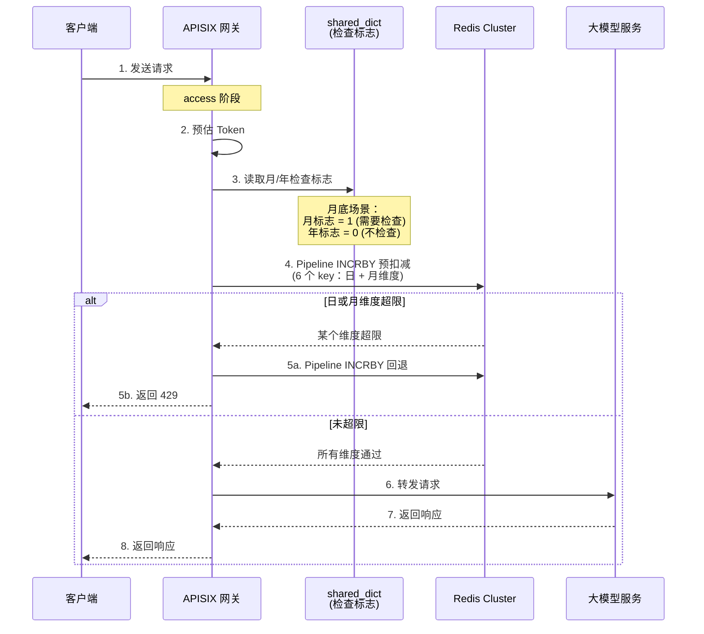

## Java 服务推送检查标志流程

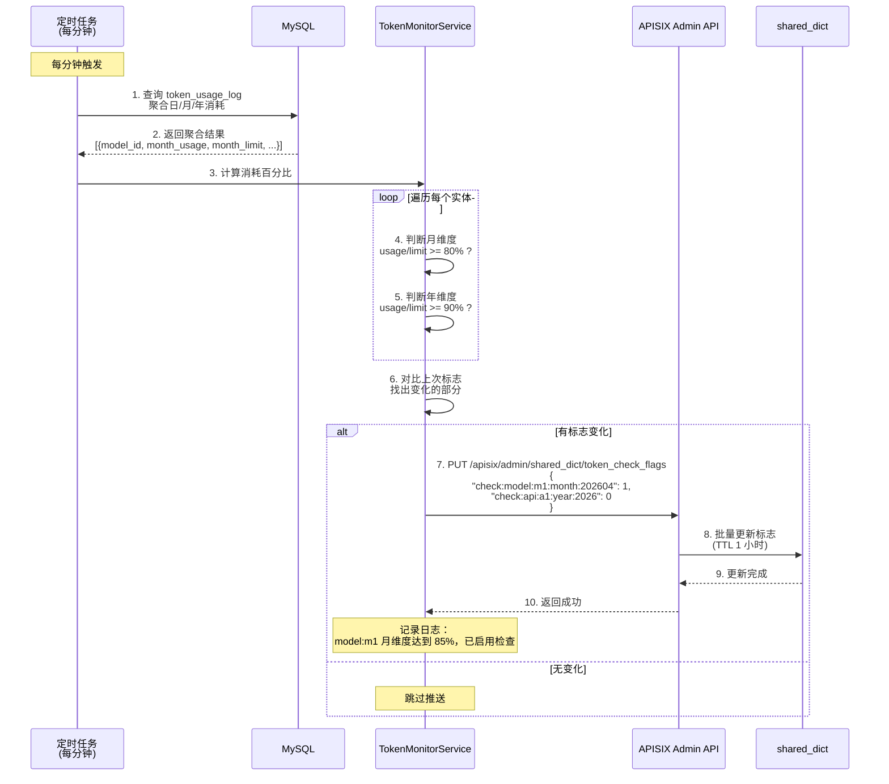

## 外部服务架构交互图

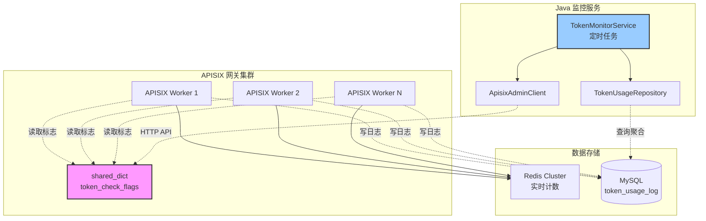

## 关键时间点（动态检查优化版本）

| 阶段 | 操作 | 月初耗时 | 月底耗时 | 说明 |
|---|---|---|---|---|
| access | 预估 Token | < 1ms | < 1ms | 本地计算 |
| access | 读取检查标志 | < 0.1ms | < 0.1ms | shared_dict 本地内存读取 |
| access | Pipeline INCRBY | **0.5-1ms** | 1-1.5ms | 月初 3 key，月底 6 key |
| access | 超限回退 | 0.5-1ms | 1-1.5ms | 仅超限时触发 |
| access | 异步更新月/年 | 异步 | - | 月初需要，月底不需要 |
| access | 转发上游 | 100-5000ms | 100-5000ms | 取决于模型响应速度 |
| log | 提取实际 Token | < 1ms | < 1ms | 解析 JSON |
| log | 写 MySQL | 5-20ms | 5-20ms | 异步，不阻塞响应 |
| log | 更新 Redis | 1-3ms | 1-3ms | 异步，不阻塞响应 |
| Java 服务 | 聚合查询 | 100-500ms | 100-500ms | 每分钟一次 |
| Java 服务 | 推送标志 | 10-50ms | 10-50ms | 仅推送变化的标志 |

**性能提升：**
- 月初场景：从 1-3ms 降低到 **0.5-1ms**（提升 50%）
- 月底场景：1-1.5ms（仅检查需要的维度）
- 年底场景：1.5-2ms（检查日+月+年）

## 性能对比

| 场景 | 原方案（检查 9 key） | 优化方案（动态检查） | 提升 |
|---|---|---|---|
| 月初/年初 | 1-3ms | **0.5-1ms** | 50-66% |
| 月中（月维度启用） | 1-3ms | 1-1.5ms | 25-50% |
| 月底/年底 | 1-3ms | 1.5-2ms | 16-33% |

## 标志推送示例

### 场景 1：月初（所有标志为 0）

```json
{
  "check:model:gpt-4:month:202604": 0,
  "check:model:gpt-4:year:2026": 0,
  "check:api:api_001:month:202604": 0,
  "check:api:api_001:year:2026": 0,
  "check:app:app_123:month:202604": 0,
  "check:app:app_123:year:2026": 0
}
```

**APISIX 行为：**
- 只检查 3 个 key（日维度）
- 月/年维度异步更新，不检查限额

### 场景 2：月底（月维度达到 85%）

```json
{
  "check:model:gpt-4:month:202604": 1,  // 变化：0 → 1
  "check:model:gpt-4:year:2026": 0,
  "check:api:api_001:month:202604": 1,  // 变化：0 → 1
  "check:api:api_001:year:2026": 0,
  "check:app:app_123:month:202604": 0,
  "check:app:app_123:year:2026": 0
}
```

**Java 服务只推送变化的 2 个标志：**
```json
{
  "check:model:gpt-4:month:202604": 1,
  "check:api:api_001:month:202604": 1
}
```

**APISIX 行为：**
- 检查 6 个 key（日 + 月维度）
- 年维度仍然异步更新

### 场景 3：年底（年维度达到 92%）

```json
{
  "check:model:gpt-4:month:202612": 1,
  "check:model:gpt-4:year:2026": 1,  // 变化：0 → 1
  "check:api:api_001:month:202612": 1,
  "check:api:api_001:year:2026": 1,  // 变化：0 → 1
  "check:app:app_123:month:202612": 0,
  "check:app:app_123:year:2026": 0
}
```

**APISIX 行为：**
- 检查 9 个 key（日 + 月 + 年维度）
- 全维度严格限流

## 故障容错

### Java 服务故障

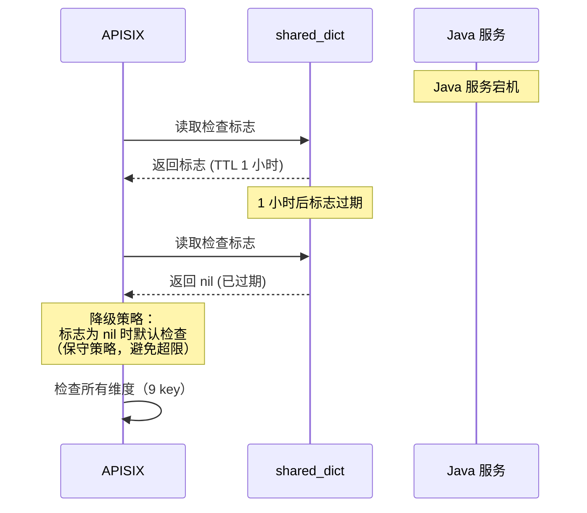

**容错机制：**
1. 标志 TTL 设置为 1 小时
2. 标志过期后，APISIX 默认检查所有维度（降级为原方案）
3. Java 服务恢复后，自动重新推送标志

### Redis Cluster 故障

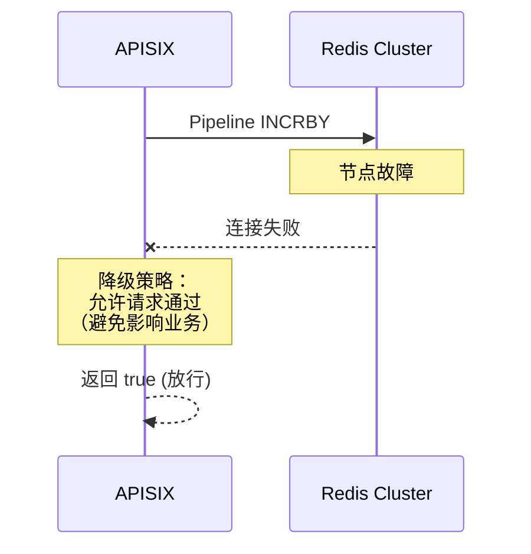

**容错机制：**
1. Redis 连接失败时，插件降级放行
2. 定期同步任务会从日志表校准数据
3. Redis 恢复后，自动恢复限流功能

## 数据一致性保障

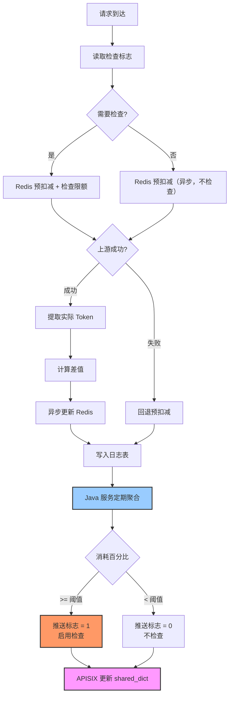


## 上游失败流程（5xx/超时）

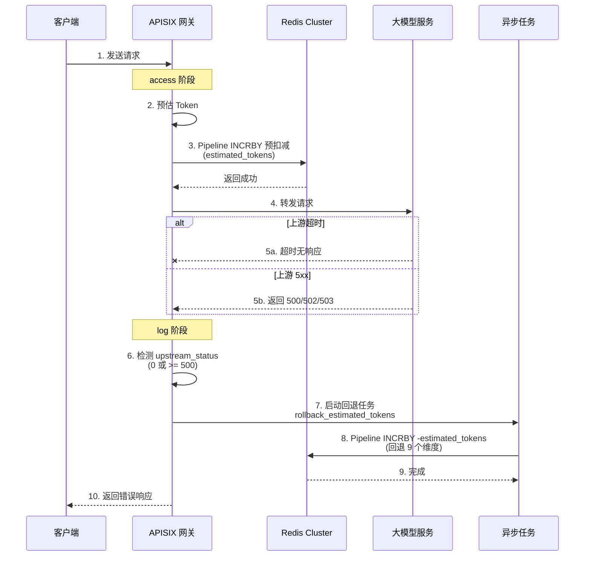

## Redis Cluster 内部处理流程

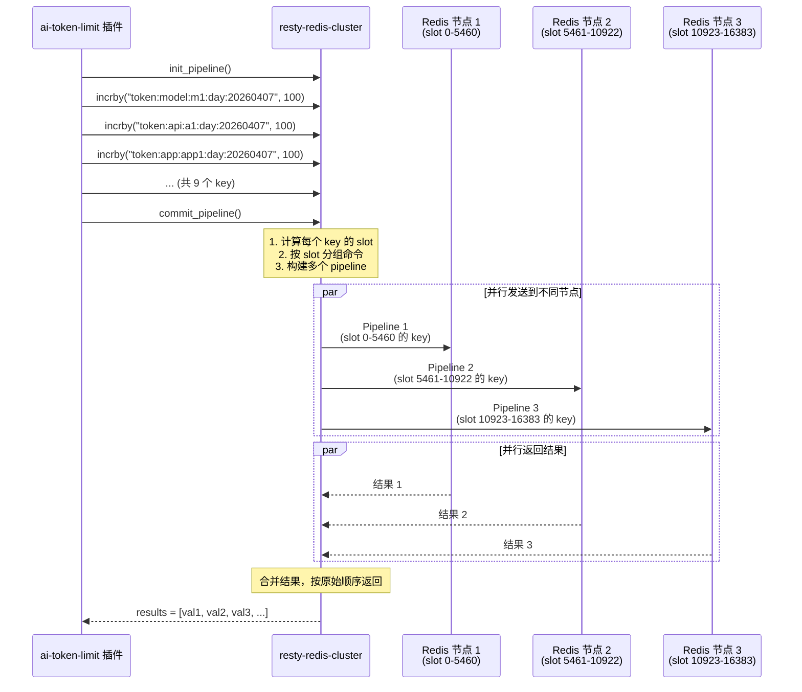

## 超限回退流程详解

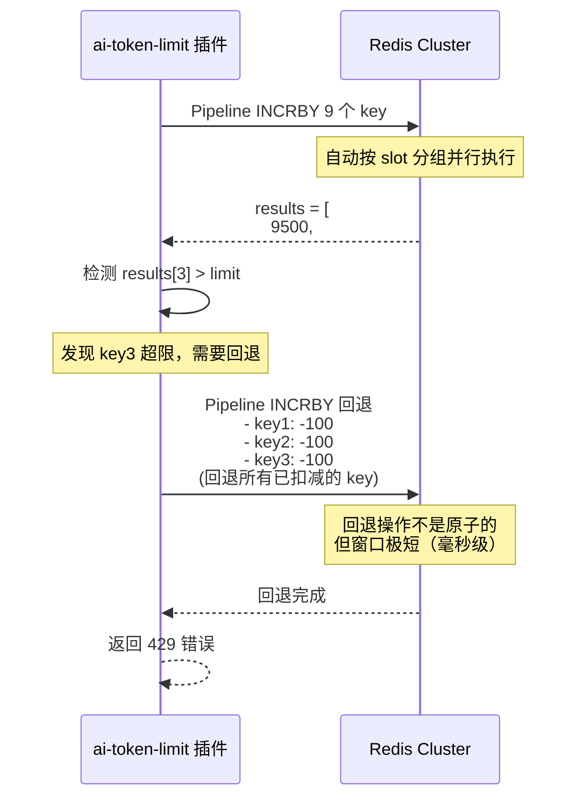

## 优化版：本地聚合 + 批量刷新

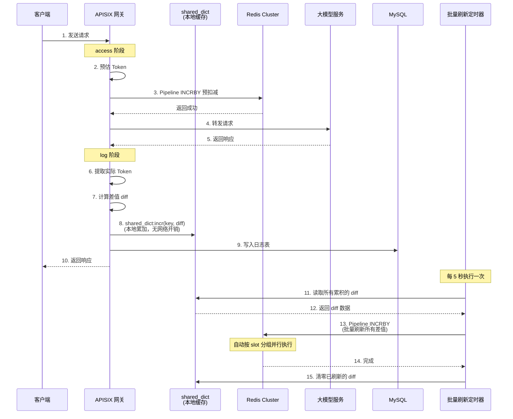

## 关键时间点（Redis Cluster 版本）

| 阶段 | 操作 | 耗时 | 说明 |
|---|---|---|---|
| access | 预估 Token | < 1ms | 本地计算 |
| access | Pipeline INCRBY (9 key) | 1-3ms | 自动按 slot 分组并行发送<br/>（耗时 = 最慢节点的 RTT） |
| access | 超限回退 | 1-3ms | 仅超限时触发，同样并行 |
| access | 转发上游 | 100-5000ms | 取决于模型响应速度 |
| log | 提取实际 Token | < 1ms | 解析 JSON |
| log | 写 MySQL | 5-20ms | 异步，不阻塞响应 |
| log | 更新 Redis (原版) | 1-3ms | 异步，不阻塞响应 |
| log | 写 shared_dict (优化版) | < 0.1ms | 本地内存操作 |
| 批量刷新 | Pipeline 更新 Redis | 1-5ms | 每 5 秒一次 |
| 定期同步 | 聚合查询 + 更新 | 100-1000ms | 每小时一次 |

**注意：**
- 以上耗时基于单 key 读取 1ms 的网络环境
- Pipeline 并行发送到多个节点，耗时取决于最慢节点
- 如果 9 个 key 全部落在同一节点，耗时与单机版相同（1-2ms）
- 如果分布在 3 个节点，理论耗时仍为 1-2ms（并行）

## 并发场景示例（Redis Cluster）

### 场景：3 个并发请求同时到达

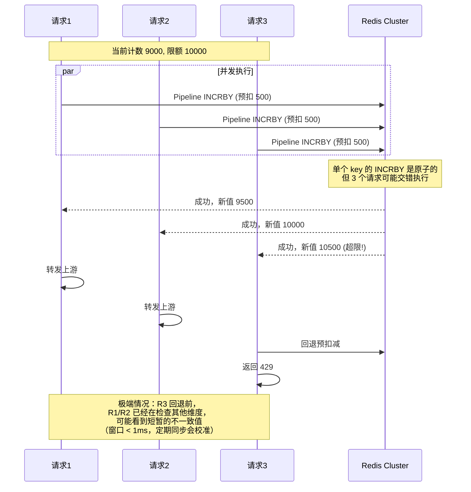

## 数据一致性保障（Redis Cluster 版本）

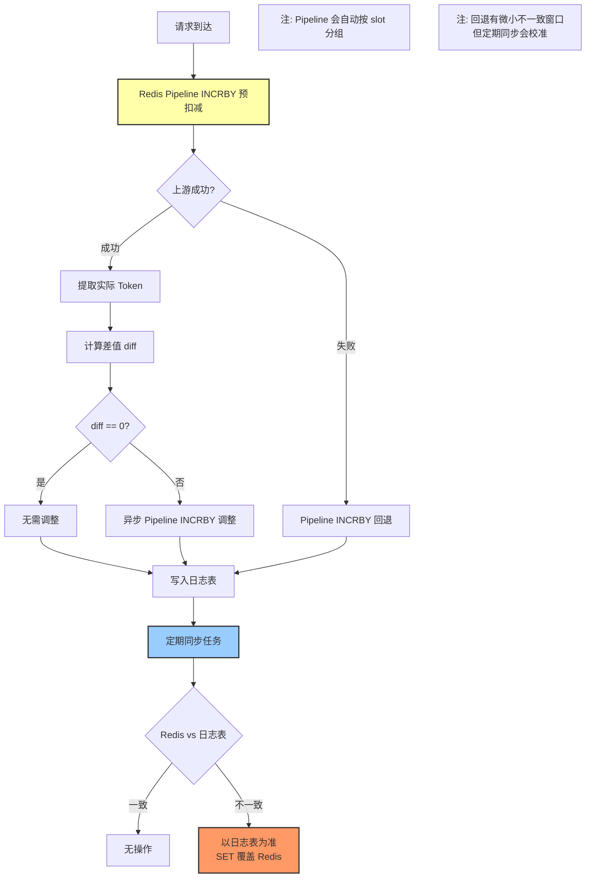

## Redis Cluster vs 单机 Redis 对比

| 维度 | 单机 Redis | Redis Cluster |
|---|---|---|
| 限流实现 | Lua 脚本原子操作 | Pipeline INCRBY + 回退 |
| 原子性 | 完全原子 | 单 key 原子，回退有微小窗口 |
| 网络往返 | 1 次 EVAL | N 次并行 Pipeline（N=涉及的节点数） |
| 超限精度 | 精确 | 最多超出一个请求的 estimated_tokens |
| 可用性 | 需配合 Sentinel | 内置主从切换 |
| 扩展性 | 单节点瓶颈 | 水平扩展 |
| 适用场景 | 测试环境、小规模 | 生产环境、大规模 |

## 关键差异说明

### 1. 不使用 Lua 脚本

**原因：** 9 个 key 分布在不同 slot，Redis Cluster 不支持跨 slot 的 Lua 脚本

**替代方案：** Pipeline INCRBY + 检查返回值 + 超限回退

### 2. 自动 slot 分组

`resty-redis-cluster` 会自动：
- 计算每个 key 的 slot（CRC16 哈希）
- 按 slot 分组命令
- 并行发送到对应节点
- 合并结果按原始顺序返回

### 3. 微小不一致窗口

**场景：** 请求 A 的 key1-8 已扣减，key9 超限需要回退

**窗口：** 回退期间（< 1ms），其他请求可能读到 key1-8 的偏大值

**影响：** 可能导致短暂误拦截，但定期同步会校准

### 4. 性能优化

- **连接池：** `keepalive_cons = worker数 × 节点数 × 2`
- **超时控制：** `connection_timeout = 1000ms`
- **批量操作：** 尽量使用 pipeline 减少网络往返

